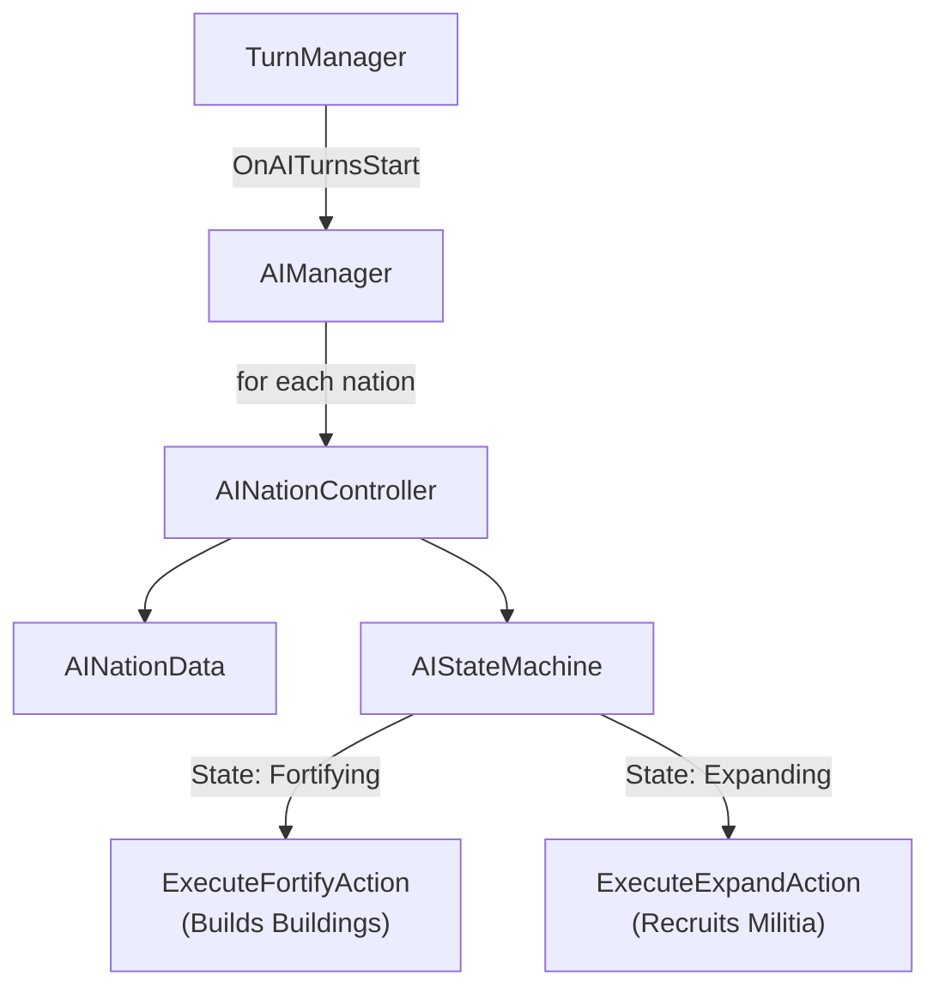

# AI Opponent System - Walkthrough

## What Was Built

An **active AI brain** for all 20 non-player nations that now takes concrete actions to strengthen itself. Each AI nation:
1. **Collects income** from its provinces every turn
2. **Evaluates its situation** (Idle / Expanding / Fortifying)
3. **Executes actions** based on that state:
   - **Fortifying**: Builds buildings to improve economy/defense
   - **Expanding**: Recruits militia to strengthen border defenses

## Architecture



## AI Actions Implemented

### 1. Fortifying (Building Construction)
- **Goal**: Spend gold to improve long-term stats.
- **Logic**:
  1. Finds a random owned province that has space for buildings.
  2. Checks available gold against building costs (using `Builder` system).
  3. Constructs a random affordable building.
  4. Logging: `[AI: Nation] Turn X: Built Farm in Province Y (-100g)`

### 2. Expanding (Militia Recruitment)
- **Goal**: Prepare for war by strengthening borders.
- **Logic**:
  1. Identifies "border provinces" (neighbors to enemies).
  2. Converts **10% of population** into **Defense Force**.
  3. Cap: Max 200 troops per turn to avoid depopulation.
  4. Logging: `[AI: Nation] Turn X: Expanding — recruited 50 militia in BorderProvince`

## Unity Setup Required

1. Create an **empty GameObject** in your scene called `AIManager`.
2. Attach the **AIManager** script component to it.
3. Ensure **Builder** script is present in the scene (usually on a Game Manager object).

## What To Look For In Console

```
[AIManager] === Processing AI Turns (Turn 5) ===
[AI: Persin Empire] State: Fortifying
[AI: Persian Empire] Turn 5: Built Fortress in Tabriz (-500g)
[AI: Russian Confederation] State: Expanding
[AI: Russian Confederation] Turn 5: Expanding — recruited 120 militia in Moscow
[AIManager] === AI Summary ===
[AIManager] Expanding: 6 | Fortifying: 4 | Idle: 10
```

## Next Steps

1. **Mobile Armies**: Allow AI to spawn actual `Army` objects that can move.
2. **Attacking**: AI moves armies to enemy provinces and initiates sieges.
3. **Diplomacy**: AI nations form alliances against common threats.
